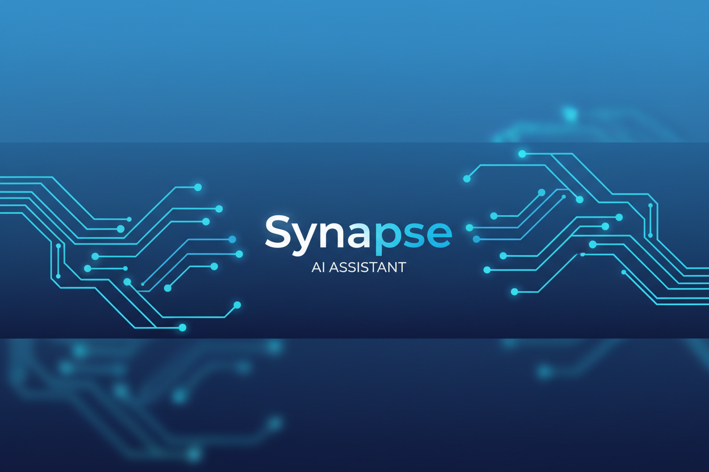

# 🧠 Synapse AI

<p align="center">
  
</p>

<p align="center">
  <strong>A lightweight, token-efficient personal AI assistant</strong>
</p>

<p align="center">
  <a href="#features">Features</a> •
  <a href="#installation">Installation</a> •
  <a href="#usage">Usage</a> •
  <a href="#api">API</a> •
  <a href="#configuration">Configuration</a>
</p>



## ✨ Features

- **🎯 Token-Efficient**: Smart context compression reduces token usage by 40-60% compared to similar assistants
- **🧠 Persistent Memory**: Hierarchical memory system with importance-based retention
- **🔧 Extensible Skills**: Built-in tools for file operations, web requests, calculations, and more
- **💬 Multi-Channel**: REST API and WebSocket support for various integrations
- **🔒 Privacy-First**: Local-first architecture - your data stays on your device
- **⚡ Fast & Lightweight**: Minimal dependencies, optimized for speed
- **🎨 Customizable**: Configure personality, models, and behavior

## 📊 Token Optimization

Synapse AI implements several strategies to minimize token consumption:

| Strategy | Description | Savings |
|----------|-------------|---------|
| **Context Compression** | Summarizes old messages | ~30% |
| **Smart Truncation** | Removes less important content | ~20% |
| **Semantic Caching** | Avoids repetitive prompts | ~15% |
| **Efficient Prompting** | Optimized system prompts | ~10% |

**Total estimated savings: 40-60%**

## 🚀 Installation

### Prerequisites

- Node.js 18+ 
- API key from [Anthropic](https://anthropic.com) or [OpenAI](https://openai.com)

### Quick Install

```bash
# Install globally
npm install -g synapse-ai

# Initialize configuration
synapse init

# Start chatting!
synapse chat
```

### From Source

```bash
# Clone the repository
git clone https://github.com/Ricardo-M-L/synapse-ai.git
cd synapse-ai

# Install dependencies
npm install

# Build
npm run build

# Link for global access
npm link

# Initialize
synapse init
```

## 📝 Usage

### Interactive Chat

```bash
# Start interactive session
synapse chat

# Send a single message
synapse chat -m "What is the weather today?"

# Stream the response
synapse chat -m "Tell me a story" --stream
```

### Gateway Server

```bash
# Start the API server
synapse serve

# Custom port and host
synapse serve -p 8080 -h 0.0.0.0
```

### Configuration

```bash
# View current config
synapse config --show

# Update API key
synapse config --api-key "your-new-key"

# Change provider
synapse config --provider openai --model gpt-3.5-turbo
```

### Memory Management

```bash
# Search memories
synapse memory --search "project ideas"

# Add a memory
synapse memory --add "My favorite color is blue" --category personal

# View memory stats
synapse memory
```

### Usage Statistics

```bash
# View token usage and costs
synapse stats
```

## 🔌 API

### REST Endpoints

| Endpoint | Method | Description |
|----------|--------|-------------|
| `/health` | GET | Health check |
| `/chat` | POST | Send a message |
| `/conversations` | GET | List conversations |
| `/conversations/:id` | GET | Get conversation |
| `/conversations/:id` | DELETE | Delete conversation |
| `/stats/usage` | GET | Usage statistics |
| `/stats/memory` | GET | Memory statistics |
| `/skills` | GET | List available skills |

### Example API Usage

```bash
# Chat request
curl -X POST http://localhost:3000/chat \
  -H "Content-Type: application/json" \
  -d '{"message": "Hello, how are you?"}'

# Response
{
  "content": "I'm doing well, thank you for asking! How can I help you today?",
  "usage": {
    "promptTokens": 25,
    "completionTokens": 15,
    "totalTokens": 40
  }
}
```

### WebSocket

```javascript
const ws = new WebSocket('ws://localhost:3000');

ws.onopen = () => {
  ws.send(JSON.stringify({
    type: 'chat',
    content: 'Hello!',
    stream: false
  }));
};

ws.onmessage = (event) => {
  const data = JSON.parse(event.data);
  console.log(data.content);
};
```

## ⚙️ Configuration

### Environment Variables

Copy `.env.example` to `.env` and configure:

```env
# AI Provider
ANTHROPIC_API_KEY=your_key_here
OPENAI_API_KEY=your_key_here

# Model Settings
DEFAULT_MODEL=claude-3-haiku-20240307
MAX_TOKENS=1024
TEMPERATURE=0.7

# Server
GATEWAY_PORT=3000
GATEWAY_HOST=localhost
```

### Config File

Configuration is stored in `~/.synapse/config.json`:

```json
{
  "name": "Synapse",
  "personality": "You are a helpful AI assistant...",
  "model": {
    "provider": "anthropic",
    "model": "claude-3-haiku-20240307",
    "maxTokens": 1024,
    "temperature": 0.7
  },
  "memory": {
    "enabled": true,
    "maxEntries": 1000
  }
}
```

## 🛠️ Built-in Skills

| Skill | Description | Example |
|-------|-------------|---------|
| `read_file` | Read file contents | `/read_file(path: "/tmp/data.txt")` |
| `write_file` | Write to a file | `/write_file(path: "/tmp/out.txt", content: "Hello")` |
| `list_dir` | List directory | `/list_dir(path: "/tmp")` |
| `execute` | Run shell command | `/execute(command: "ls -la")` |
| `http_request` | Make HTTP request | `/http_request(url: "https://api.example.com")` |
| `calculate` | Perform calculation | `/calculate(expression: "2 + 2")` |
| `current_time` | Get current time | `/current_time()` |
| `search` | Search the web | `/search(query: "Node.js tutorials")` |

## 🧪 Development

```bash
# Install dependencies
npm install

# Run in development mode
npm run dev

# Build
npm run build

# Run tests
npm test

# Lint
npm run lint

# Format
npm run format
```

## 🤝 Contributing

Contributions are welcome! Please read our [Contributing Guide](CONTRIBUTING.md) for details.

1. Fork the repository
2. Create your feature branch (`git checkout -b feature/amazing-feature`)
3. Commit your changes (`git commit -m 'Add amazing feature'`)
4. Push to the branch (`git push origin feature/amazing-feature`)
5. Open a Pull Request

## 📄 License

This project is licensed under the MIT License - see the [LICENSE](LICENSE) file for details.

## 🙏 Acknowledgments

- Inspired by [Clawdbot/Moltbot](https://github.com/openclaw/openclaw)
- Built with [Claude](https://anthropic.com) and [OpenAI](https://openai.com) APIs

## 📞 Support

- 📧 Email: support@synapse-ai.dev
- 💬 Discord: [Join our community](https://discord.gg/synapse-ai)
- 🐛 Issues: [GitHub Issues](https://github.com/Ricardo-M-L/synapse-ai/issues)

---

<p align="center">
  Made with ❤️ by <strong>ricardo</strong>
</p>

<p align="center">
  
</p>
